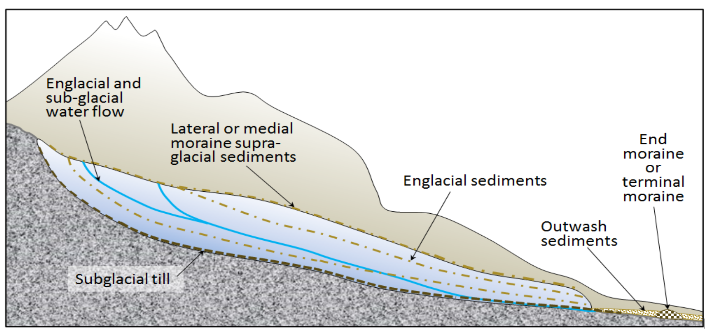
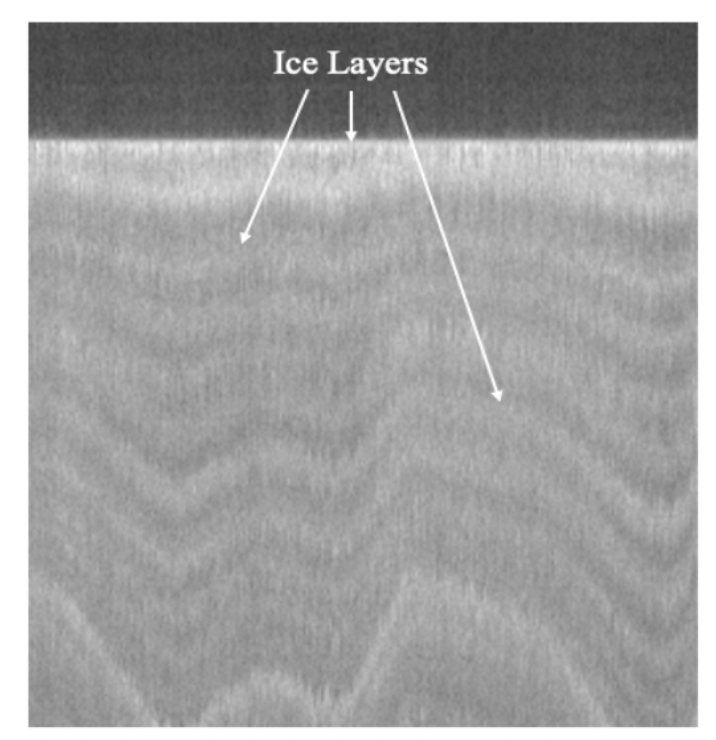
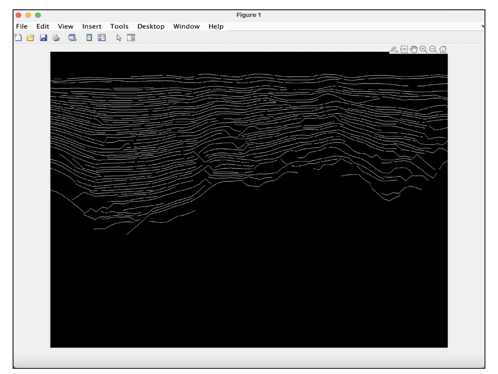
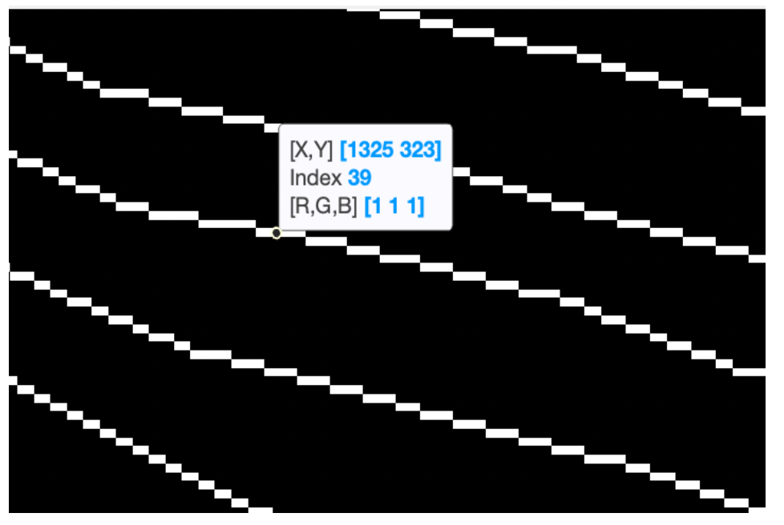

# Object Tracking for Englacial Layers

This study aims to examine existing methods for evaluating the quality of images and apply them to radargrams to identify metrics that focus on the continuity of layers within them. The research includes the implementation of object-tracking techniques to track and analyze the layers. Furthermore, various approaches for layer tracking and continuation will be explored. The ultimate goal is to develop a comprehensive metric that can accurately assess the quality of englacial layers. This research contributes to the understanding and assessment of englacial layers, providing valuable insights for glaciological studies and related fields.

## What are englacial layers?

Glaciers are formed when layers of snow build up on top of one another. Each layer of snow has a unique chemistry and texture. Over time, the snow's top layer compresses due to the weight of the layers beneath it, finally turning to ice. The ice also contains particles and dissolved substances that were caught by the snow as it fell. As layers of ice accumulate over time, they serve as a record of the climate conditions that prevailed at the time of creation. The ice layers are arranged according to years and seasons. Studying how and why climate changed in the past helps scientists predict climate change in the future.  

  

Fig - Depiction of the various types of sediments associated with glaciation. The glacier is shown in cross-section.  

Fig from Open textbook - Geology chp - How glaciers work - [http://water.usgs.gov/edu/gallery/glacier-satellite.html]  

Using radar data, the slopes of the englacial layers' can be calculated. Radargrams for glacial strata are produced using ground-penetrating radar (GPR) or ice-penetrating radar equipment. These radars generate electromagnetic waves that travel through the ice layers, and then reflect off of the ice's edges and internal interfaces. The radar system then creates radargrams by capturing the signals that are reflected. Radar data can be used to investigate ice sheet movement, spot areas of stress and strain, and forecast how the ice sheet will behave in the future.   

## Layer Continuity and other problems

Information on glacial layers and bedrock is generally obtained from radargrams. However, most of the information is extracted manually. Manual extraction is less efficient as it is subjected to various factors, such as human actions and emotions. Therefore, there is a need to develop automatic or semi-automatic methods for tracking layers in radiostratigraphic images. A major challenge of the automated extraction method is the small distance between the ice layers during extraction, which can lead to confusion and incorrect connection of multiple optional layers. Various methodologies have been developed for tracing hierarchical glacier continuity. Techniques such as manual selection of internal layers, iterative peak tracking, and pattern matching with ice models along with the automatic radio echo sounder processing (ARESP) algorithm, and the glacier droplet estimation algorithm for continuous wavelet transform peak detection have been developed. The lack of stratigraphic continuity in glacial strata makes it difficult to track, interpret and understand the history, behavior, and properties of ice sheets. 

Fig - Ice layers in a radargram.  

## Object Tracking

Object tracking is the process of identifying and tracking specific objects in an image or video sequence over time. This includes detecting and tracking the position, size, shape, and other relevant attributes of objects over successive frames. 
Continuous layers in the radargram ease the analysis of the ice sheet. For layer building and layer continuity, it is important to be able to track layers effectively and accurately. After tracking individual layers using radar data, multiple layers can be tracked, improving the quality of radar imagery and facilitating the study of glacier data.  

1.3.1 Single Object Tracking:
Single Object Tracking (SOT) focuses on tracking a single object of interest within a sequence of images or video frames. The goal of SOT algorithms is to accurately track the movement, position, and other attributes of a chosen object over time. The main challenge of SOT is to maintain the continuity and identity of the tracked object even when its appearance, scale, orientation, or occlusion changes. The SOT algorithm aims to overcome these challenges using various visual cues and tracking techniques such as Kernelized Correlation Filter (KCF), Discriminative Correlation Filter (DCF), Kalman Filters, and Particle Filters. 

1.3.2 Multiple Object Tracking:
Multiple Object Tracking (MOT) deals with the simultaneous tracking of multiple objects within a video sequence or series of images. Unlike single-object tracking, which focuses on tracking single objects, MOT preserves the object’s identities and understands their interactions and behavior over time. The purpose of tracking multiple objects is to accurately track the position, trajectory, and other attributes of multiple objects of interest in a dynamic scenario. MOT algorithms have to deal with challenges such as occlusion, object appearance changes, object interaction, and varying object counts. 

## Assessing the quality of established metrics

Quality metrics should be checked for their correctness, timeliness, and accuracy. The correctness measures the numerical characteristics. In our case, for measuring the correctness quality metric we could measure the layer thickness, and layer dip or inclination. The individual layer thicknesses can reveal important details regarding the ice flow dynamics and depositional history. Understanding changes in accumulation rates, ice flow velocities, or other factors impacting layer formation can be achieved by measuring and evaluating thickness variations. Understanding ice flow patterns, strain rates, or basal conditions can be gained by quantifying the layers' inclination or dip angle. 

The ‘Measure of Completeness’ (MOC) metric which is used to assess the effectiveness of multiple object tracking algorithms may also be used to rate the effectiveness of glacier layers. The MOC value measures the target coverage within a given interval for the region of interest, given as a number between 0 and 1. 0 indicates that there is no target coverage and 1 indicates a complete target coverage. ‘Track Continuity Measure’ (TCM) can also be used as a metric where it describes the tracking quality by calculating the duration of the target (presence of the target in the region of interest in a particular interval of time) for all the tracks associated. It also calculates the target undetectability and track persistence using the information about associated tracks with the target and their duration. 

## Experiments
We tried to perform object tracking for a single layer in a radargram. 

### Algorithm for Layer Tracking 
The following algorithm (by my advisor Dr. Rebecca Williams) describes the steps undertaken to perform the layer tracking from a MATLAB (.mat) file containing englacial data information. The algorithm takes a .mat file input and produces a video file (.mp4) which shows a rectangle tracing a single layer (hardcoded) from the layers in a given radargram. 

1. Select a layer's data file (in .mat format).
2. Load the maskStruct from the maskPath.
3. Extract the maskLabels from the maskStruct.
4. Find the unique labels in the maskLabels.
5. Rescale the maskLabels to fit the video in memory.
6. Create a layerIsolate array by setting all values not equal to that particular layer (hardcoded layer index) to 0.
7. Get the number of rows and number of columns of the maskLabels.
8. Initialize variables for frame arrays and frame index.
9. Iterate over each column in frames2use.
a. Initialize a frame array and frame trail array (if addTail is true).
b. Find the row number where the layer exists in the current column.
c. If the row number is not empty, set the corresponding row in the frame array to true. And if addTail is true, also set the corresponding row in the frame trail array to true.
d. Add the frame and frame trail (if addTail is true) arrays to the frameArray and frame_trail_array, respectively.
10. Process the movie frames for "detect" by dilating the target in each frame using targetMorph parameters.
11. If extractBboxes is true, calculate the bounding box for each frame and store it in target_bbox.
12. Process the movie frames for "tail" (if addTail is true) by fading the tail and combining it with the morphed frames.
13. Write the frames to a video file.
14. Close the video file.

## Results

### The layers in a .mat file  

  

### Zoomed-in layers diagram showing layer information  

